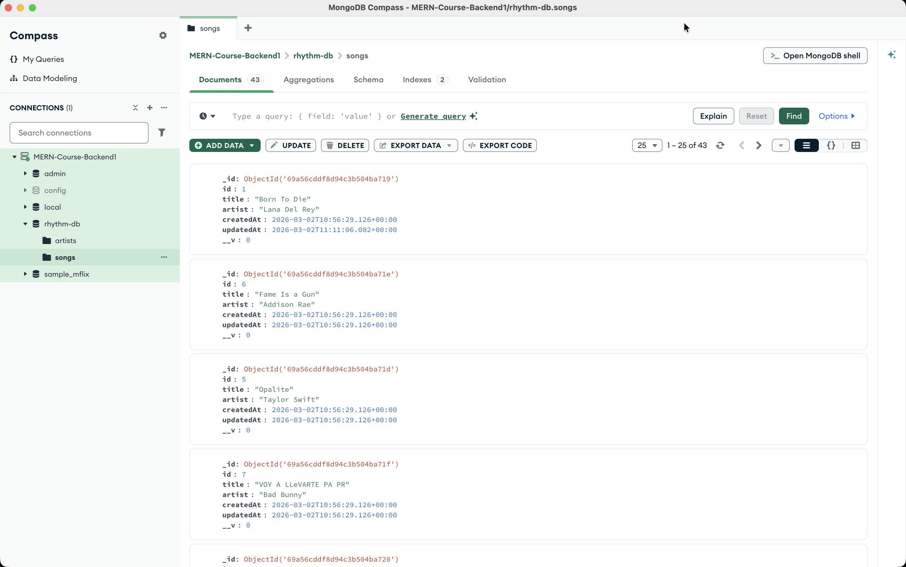

# My Professional Portfolio 🚀

Welcome to my personal portfolio website! This project showcases my journey as a developer, featuring my projects, technical skills, and a way to get in touch.

## 🛠️ Built With
* **React.js** - Frontend framework
* **CSS Modules** - For scoped and maintainable styling
* **Vite** - Next-generation frontend tooling
* **React Icons** - For professional iconography

## 🌟 Features
* **Code-Editor Aesthetic**: A unique design inspired by development environments.
* **Project Showcase**: Dynamic rendering of my latest work.
* **Responsive Layout**: Designed for a seamless web experience (Mobile version under development).
* **Deployment**: Automatically deployed via Netlify.

## 🚀 Live Demo
Check out the live site here: [https://manau-portfolio.netlify.app/](https://manau-portfolio.netlify.app/)

## 🤖 AI Collaboration
This project was developed with the support of **Gemini**, which served as a technical co-pilot for debugging, architectural discussions, and UI refinements.

## 📈 Future Updates
- [ ] Mobile-responsive design (Media Queries)
- [ ] Integration with my Rhythm API (MongoDB/Node.js)